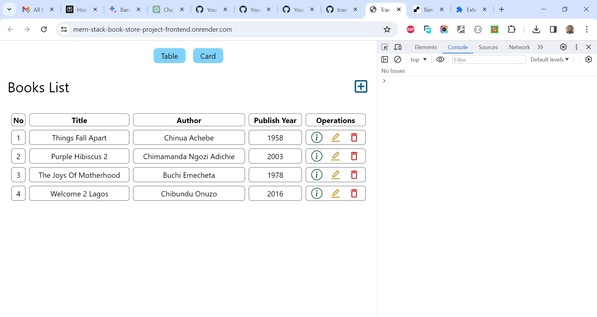

# freeCodeCamp's MERN Stack Book Store Project (Frontend)

This is a solution to the [freeCodeCamp's MERN Stack Book Store Project (Frontend)](https://www.youtube.com/watch?v=-42K44A1oMA). I'm testing my hand creating very simple (follow along) projects for now to get familiar with the matter. 

## Table of contents

- [Overview](#overview)
  - [The challenge](#the-challenge)
  - [Screenshot](#screenshot)
  - [Links](#links)
  - [My process](#my-process)
  - [Built with](#built-with)
  - [What I learned](#what-i-learned)
  - [Continued development](#continued-development)
  - [Useful resources](#useful-resources)
  - [Author](#author)
  - [Acknowledgments](#acknowledgments)

## Overview

### The Challenge/User Stories

Learn the MERN stack (MongoDB, Express, React, Node.js) in this crash course for beginners. Here are some of the topics you will learn about:
- Backend CRUD
- Backend Router
- CORS Policy
- MongoDB operations
- Frontend CRUD 
- Frontend Router 

### Screenshot

### Links

- Solution URL: [https://github.com/traez/mern-stack-book-store-project](https://github.com/traez/mern-stack-book-store-project)
- Live Site URL: [https://mern-stack-book-store-project.onrender.com/](https://mern-stack-book-store-project.onrender.com/)

## My process

### Built with

- Semantic HTML5 markup 
- CSS custom properties 
- Flexbox 
- CSS Grid 
- Mobile-first workflow 
- [React](https://reactjs.org/) - JS library 
- [Next.js](https://nextjs.org/) - React framework (No)
- Tailwind CSS  
- Typescript (No)
- Nodejs
- Expressjs
- MongoDB

### What I learned

- Proper use of .env file to save backend endpoints in Vite React frontend, for better code base maintainability.  To be mindful of endpoint ending "/" in both development and production environment.  
- Adding of environmental variables in host Render's dashboard before deploying.  
- Tweaking of ite.config.js file to reflect build directory.  
- Creating Frontend Repo as Static Site on Render. While leaving Backend Repo as Web Service.   

### Continued development

- More increasingly complex MERN stack projects. 

### Useful resources

Stackoverflow  
YouTube  
Google  
ChatGPT

## Author

- Website - [Trae Zeeofor](https://github.com/traez)
- Twitter - [@trae_z](https://twitter.com/trae_z)

## Acknowledgments

To all MERN stack Developers and Content Creators. Well done!.
